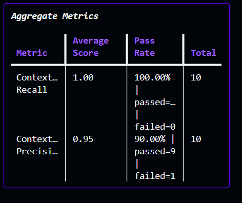
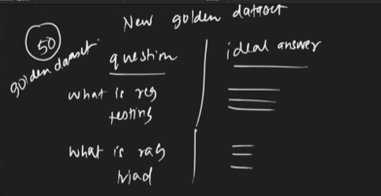
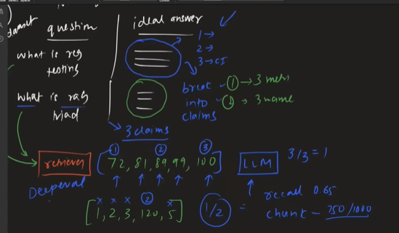
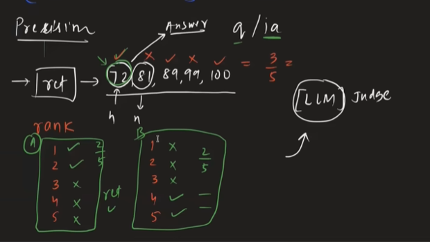
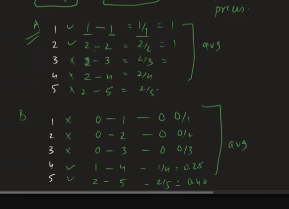
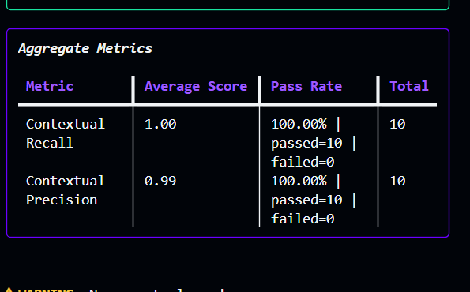

all ok
uv add langchain-openai langchain-chroma langchain-text-splitters langchain-core chromadb openai sentence-transformers deepeval pytest python-dotenv langchain-cohere
build the retriever 1st
query->embediing model->vector->vector db->chunks->find->come and give->embed->text->return 

failures during retrivation[failure metric]
    1. retriver brother getting different context which are not needed, like need 1,2 getting 9 , 10-waste
    --->to evaluate this, wee need a matrix called RECALL
    RECALL=out of all relevant context how many from vector db our retriever can bring,,,example 3/5
    2. retriver brother geeting some irrelevant and some relevant context, irrelevent ones are called noise--noisey  context,,like 1,2 needed, getting 1,4,5---wasted
    --->to evaluate this, wee need a matrix called PRECISION
    PRECISION = out of brought context how many of them are correct?

    # to increase recall we need to increase value of K ex: 5->10, but then precision reduces,,thats a trade off between 2
    # as we need the golden dataset to check this, so this 2 metrices are REFERENCE BASED EVALS

 

 as we are chaning chunking size k  
 value to get good values of recall preciosn, its making change in golden dataset, it need to rebuilded agin for this precess, which is not good thing, each time golden dataset creation is not worth it.

 so we gonnma make the golden dataset like this->
 
 
this technique is used by DEEPEVAL->this kinda eval is called CONTEXTUAL EVAL

now, as per this methond lets see how precisiion is calculated...
 
deepeval precison is called->contextual precison->calculated like this

we nned to check the the rank of the retrived chunk, better rank better precison, better eval

ways to create golden dataset
1. hand authorisd
2. llm assisted->thn review by human
3. deep eval synthesizer and human review
4. production log mining

llm test case = one row of golden dataset
metric = something that measure its relevance and threshold makes the model fail or pass
evaluate = send all test cases and get final reslut with the metric

so in summary in deep eval 3 things ->
   1. llm test case
   2. metric
   3. evaluate

now to imporve precison score we will implement reranker

### RAG Evaluation Optimization

1. **Baseline** – measure current Recall & Precision.
2. **Chunk Size** – test 500, 750, 1000, 1500; choose best.
3. **Chunk Overlap** – test 0, 50, 100, 150; balance context and redundancy.
4. **Embedding Model** – compare models; re-index after changing.
5. **Initial Top-K** – test 3, 5, 10, 20; higher K usually improves Recall.
6. **Add Reranker** – compare Precision/Recall before vs after.
7. **Reranker Candidate Pool** – test 10, 20, 30 candidates.
8. **Final Top-N** – test 3, 5, 8, 10.
9. **Hybrid Retrieval** – combine vector + BM25.
10. **Metadata Filtering** – remove irrelevant documents.
11. **Query Rewriting/Multi-query** – improve Recall.
12. **Analyze failures** – inspect low Recall/Precision and fix the actual bottleneck.

the result without reranker->

the rsult with reranker->
